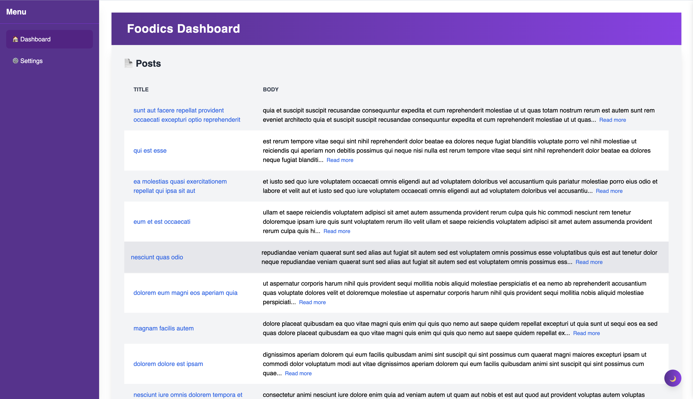
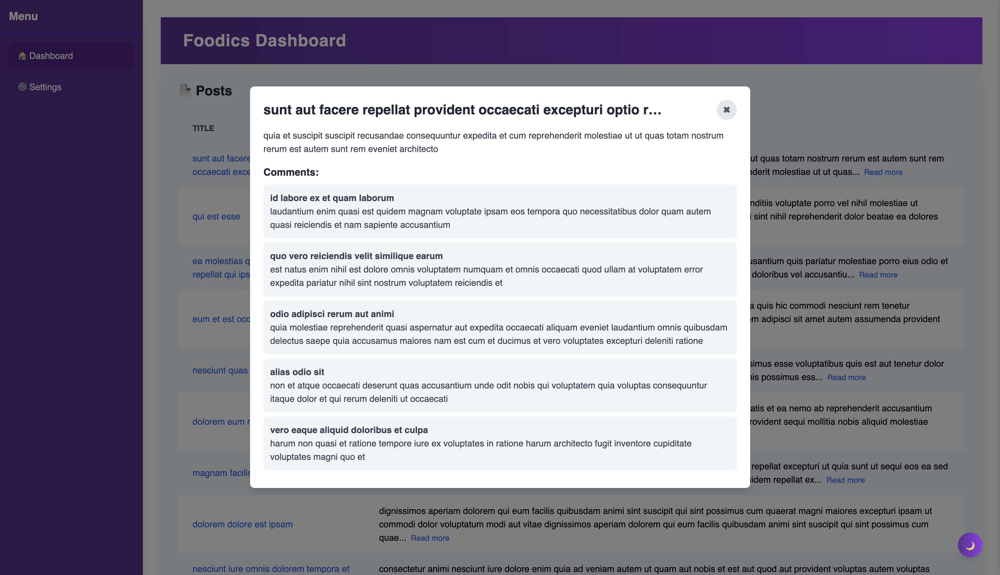
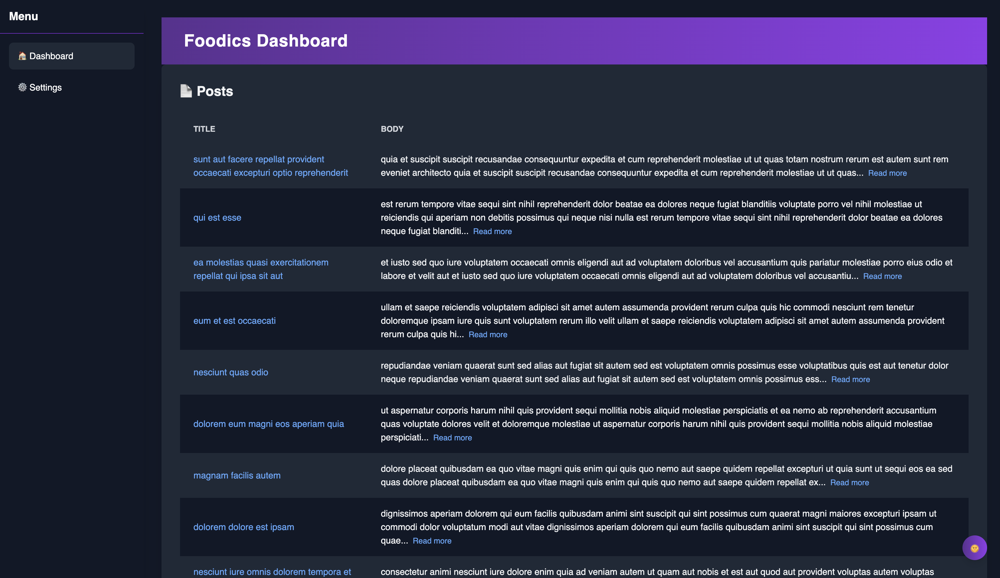
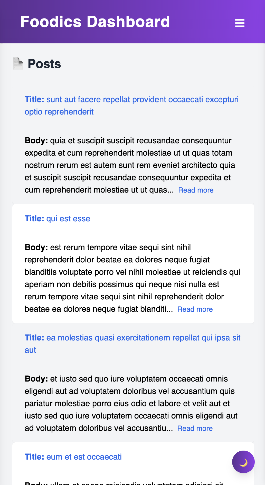
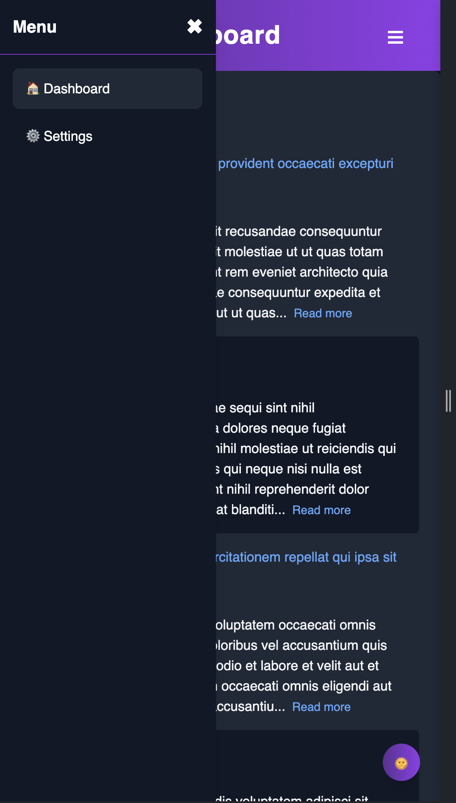

# Vue.js Dashboard with Tailwind CSS

## Project Overview
This is a responsive dashboard application built with **Vue.js 3**, **Vite**, and **Tailwind CSS**. The dashboard fetches and displays data from the JSONPlaceholder API. It includes a collapsible sidebar, a dark mode toggle, and a modal to display detailed post information with comments.

## Key Features
- **Dashboard Layout:** Header, collapsible sidebar, and main content area.
- **API Integration:** Fetches and displays posts from the JSONPlaceholder API.
- **Post Details Modal:** Shows post details and comments when a post is clicked.
- **Dark Mode:** Toggle between light and dark themes.
- **Responsive Design:** Fully optimized for desktop and mobile devices.

---

## Project Setup & Installation

### **Clone the Repository**
```bash
git clone https://github.com/albakrio/vue-dashboard.git
cd vue-dashboard
```

### **Install Dependencies**
```bash
npm install
```

### **Run the Application Locally**
```bash
npm run dev
```

### **Build for Production**
```bash
npm run build
```

### **Preview Production Build**
```bash
npm run preview
```

---

## Project Structure
```
src/
├── assets/           # Static assets (images, fonts)
├── components/       # Reusable components (Sidebar, Header, etc.)
├── features/         # Feature-specific components (Posts, Modals)
├── layouts/          # Layout components (MainLayout)
├── router/           # Vue Router configuration
├── stores/           # Pinia state management
├── views/            # Pages (Home, Settings, NotFound)
├── App.vue           # Root component
├── main.js           # Entry point
└── tailwind.config.js
```

---

## Additional Notes
- **API Used:** [JSONPlaceholder](https://jsonplaceholder.typicode.com/) for posts and comments.
- **State Management:** Implemented using **Pinia** for global state.
- **Error Handling:** Gracefully handled with custom loading indicators and error messages.
- **Dark Mode:** Managed using local storage and **Pinia**.
- **Routing:** Configured using **Vue Router**.

---

## Screenshots


**Desktop View:**







**Mobile View:**





---
**Built using Vue.js 3, Vite, and Tailwind CSS**

